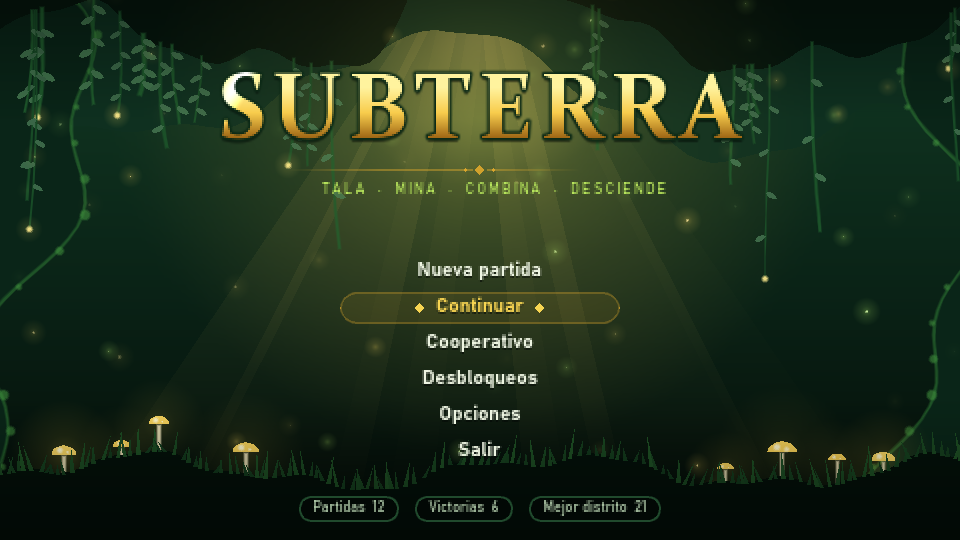
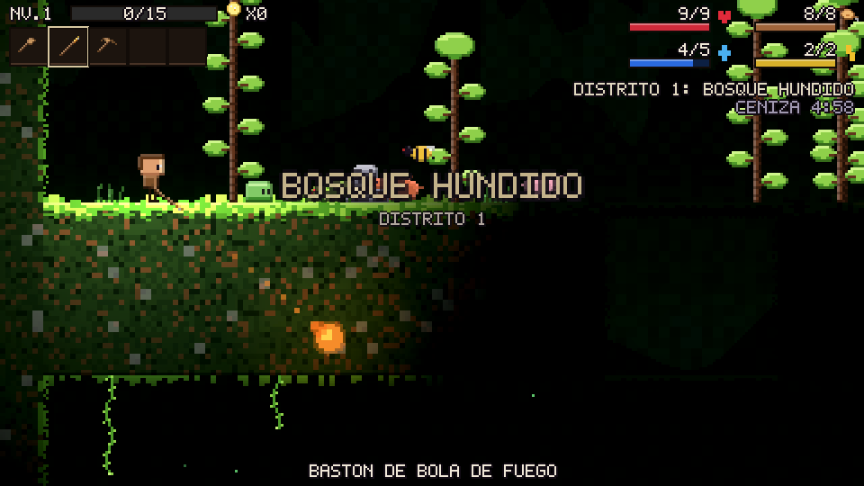
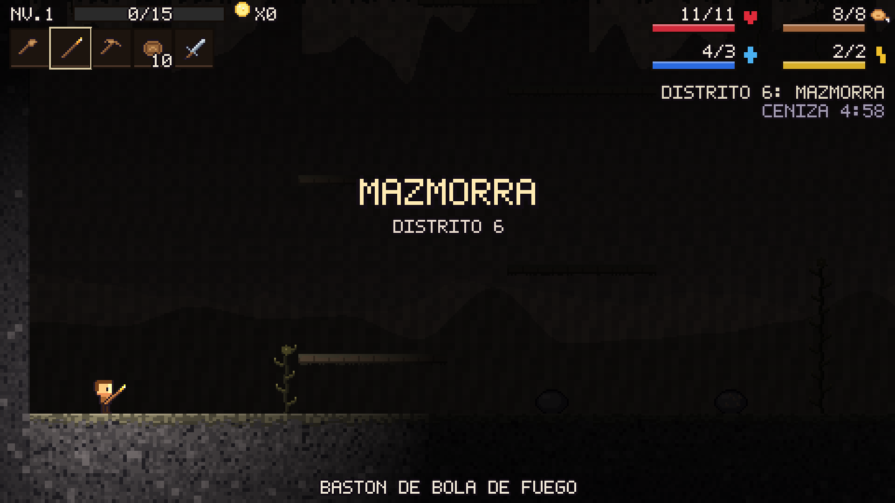

# Subterra

Roguelike de plataformas 2D con recolección y crafteo, **clon mecánico de *Magicite*** (SmashGames, 2014) hecho en Godot 4.6.
Tala, mina, combina objetos de dos en dos, baja 20 distritos eligiendo bioma en cada puerta, visita pueblos, sobrevive al hambre y a los guardianes de la Ceniza y derriba el Muro de Ceniza. Solo o en cooperativo online de hasta 4 jugadores.





> **Originalidad:** se reproducen las mecánicas, sistemas, estructura y números del original. Todo el arte, los nombres propios, los textos, la música y el sonido son **originales** y se generan por código. No se incluye ningún asset de *Magicite*.

## Qué incluye

- **20 distritos + el Nido de Ceniza** generados por semilla, con 3 puertas de bioma al final de cada uno y un pueblo entre distritos.
- **9 biomas** (Bosque Hundido, Ciénaga, Pradera Roja, Cavernas, Tundra, Mazmorra, Volcán, Cantera de Cristal y Cráter Estelar) con sus trampas, enemigos y jefes. Son **12 jefes**, entre ellos el Muro de Ceniza final y un jefe secreto.
- **Crafteo combinando dos objetos** (Mayús + clic), unas 80 recetas y más de 170 objetos, con durabilidad y calidades (normal, azul, amarilla y morada). Artesanos en el pueblo: herrero, sastra y peletero.
- **Personaje:** 15 razas, 13 rasgos (eliges 2), 24 sombreros, 9 compañeros y 14 habilidades en 3 ramas (se elige una cada 5 niveles). Estadísticas con crecimiento, hambre, maná y estamina.
- **Pueblo:** 2 tiendas, comprador, 4 altares de apuesta y gallinas (cuidado con el Gallo Rey).
- **Desbloqueos permanentes** evaluados al terminar la partida, más estadísticas globales, libro de recetas y guardado en el pueblo.
- **Modos Normal y Demente.** Cooperativo online por IP (ENet, anfitrión autoritativo).
- **Movimiento:** aceleración, tiempo de coyote, búfer de salto, salto variable, doble salto, dash con invulnerabilidad e interpolación de física.
- **Presentación estilo Magicite:** personajes chibi rechonchos y de pocos píxeles (cabeza ancha, barriga y piernas cortas), penumbra con luces 2D, terreno denso con musgo, decoración de fondo, estelas brillantes y música chiptune por bioma.
- **Qué tienes a un clic:** lo que puedes usar ahora mismo (tienda, puerta, vecino, cofre, compañero abatido, o el árbol/roca/bichos que tu herramienta puede recoger) brilla con un aura dorada, esquinas doradas y una pista encima con su tecla ("F · Hablar", "Clic · Talar"). El hacha tala con un tajo horizontal y el árbol se inclina con cada golpe.
- **Interfaz** con paleta verde y amarilla y **fuente pixelada gruesa propia** con sombra dura (`assets/fonts/subterra_pixel.ttf`, generada por `tools/make_font.py`): portada animada, menús y HUD con texto que nunca se solapa. El mundo sigue siendo pixel art de píxel uniforme (se dibuja a 480x270 en un SubViewport y se amplía en múltiplos enteros).

## Jugar

Abre el proyecto en Godot 4.6.3 y pulsa F5, o:

```bash
"C:/Users/Cobos/Desktop/Godot_v4.6.3-stable_win64.exe" --path .
```

| Acción | Tecla |
|---|---|
| Moverse / bajar de plataforma | A D / S |
| Saltar (doble salto en el aire) | Espacio |
| Dash | Q / E |
| Usar el objeto en la mano (apunta el ratón) | Clic izquierdo |
| Barra rápida | 1-5 / rueda |
| Inventario (Mayús + clic en dos objetos = combinar) | R |
| Interactuar (puertas, tiendas, cofres, revivir) | F |
| Habilidades | Z X C |
| Tirar objeto · mapa · pausa | G · Tab · Esc |

Todo se puede reasignar en *Opciones → Controles*.

### Cooperativo
En *Cooperativo*, uno pulsa **Crear partida** (puerto 7777) y los demás escriben su IP y pulsan **Unirse**. Cada jugador usa el personaje de su pantalla de creación. La partida solo termina cuando cae todo el grupo; a los compañeros abatidos se les revive con F.

## Desarrollo

```bash
# Tests (núcleo + partidas reales en headless)
"C:/Users/Cobos/Desktop/Godot_v4.6.3-stable_win64_console.exe" --headless --path . -s res://tests/run_tests.gd
# Compilar todos los scripts
"C:/Users/Cobos/Desktop/Godot_v4.6.3-stable_win64_console.exe" --headless --path . -s res://tools/check.gd
# Regenerar la fuente pixelada (requiere fonttools)
python tools/make_font.py
# Exportar todo el arte a PNG (art_export/)
"C:/Users/Cobos/Desktop/Godot_v4.6.3-stable_win64_console.exe" --headless --path . -s res://tools/export_art.gd
```

### Consola de depuración
Pulsa **`** (acento grave; en teclado español, la tecla a la derecha de la P) o **F12**. `help` lista los comandos; **Tab** autocompleta (también ids de objetos, enemigos y biomas) y **↑/↓** recorren el historial. Algunos: `give <objeto> [n]`, `spawn <enemigo> [n]`, `kill`, `heal`, `god`, `noclip`, `level <n>`, `coins <n>`, `stat atk 5`, `skill <id>`, `district <bioma> [n]`, `town`, `door <n>`, `final`, `exit`, `reveal`, `time <s>`, `speed <x>`, `unlock all`, `info`, `stats` (FPS y entidades). En cooperativo los trucos solo funcionan en el anfitrión.

### Personaje jugable: el caballero 3D
Todas las razas juegan con el mismo caballero de fantasía oscura (armadura negra, manto de pelaje blanco, negro y gris, capucha caída, capa rota y yelmo con penacho y ojos rojos tenues). Es un modelo 3D que se renderiza **en vivo** a pixel art: `KnightView` (`scripts/game/knight_view.gd`) lo pinta en un SubViewport de 64x48 con sombreado toon por escalones (`shaders/knight_toon.gdshader`) y le pone el contorno negro de 1 px (`shaders/pixel_outline.gdshader`); el héroe dibuja esa textura con los pies en su posición, la voltea según hacia dónde mire y coloca el arma en la mano derecha proyectando el hueso. Mide ~30 px (colisión 10x26).

- **Telas con física:** capa (7 cadenas), capucha, penacho del yelmo, pelaje y faldar son huesos que mueve `SpringBoneSimulator3D` con cápsulas de colisión en piernas y torso. El cuerpo 3D se desplaza en su mundo siguiendo la velocidad del héroe, así que la capa ondea al correr, sube al caer y se balancea al frenar sin animarla a mano.
- **Animaciones:** `idle`, `run`, `jump`, `fall`, `attack`, `attack_pick`, `punch`, `chop` (tajo horizontal a dos manos), `hurt`, `dash` y `down` (de rodillas), con las duraciones que usa `hero.gd`.
- **Origen:** concepto hecho con Gemini (`art_src/caballero/concepto_v4.jpg`), malla de Tripo y todo lo demás en Blender por script (`art_src/caballero/scripts/`): reducción a 30k triángulos, esqueleto de 111 huesos con nombres del perfil humanoide de Godot (dedos incluidos), pesos por distancia geodésica, animaciones (`anims.py`) y exportación a `assets/models/caballero/caballero.glb`. El GLB original de Tripo no se sube (`art_src/caballero/raw/`).

```bash
# Blender (5.x): orden de los pasos, desde art_src/caballero/
blender -b -P scripts/04_decimate.py   # raw/caballero_tripo.glb -> raw/base.blend
blender -b -P scripts/08_rig.py        # esqueleto y pesos -> raw/rig.blend
blender -b -P scripts/10_anims.py      # animaciones -> raw/anim.blend
blender -b -P scripts/12_export.py     # -> assets/models/caballero/caballero.glb
# Fotogramas para menús, retrato y estela del dash (con ventana) -> assets/sprites/caballero/
godot --path . -s res://tools/bake_knight.gd
```

El Minero por piezas ya no es el protagonista, pero su escena `scenes/pj_rig.tscn` (piezas de `tools/pj_partes.py`, animaciones de `tools/build_pj_rig.gd`) sigue siendo el esqueleto de los humanoides 2D: vecinos, tenderos y enemigos con forma de persona. `scripts/art/humanoid.gd` genera sus piezas (cabeza, torso, manos y pies con contorno negro y variantes: yelmos, setas, calaveras, túnicas…) y las monta con las poses que `RigPose` lee de las animaciones de `scenes/pj_rig.tscn`, así que todos se mueven igual. Los enemigos-criatura también van por piezas: `tools/enemigos.py` y `tools/enemigos_criaturas.py` dibujan las piezas (pivotes en `piezas.json`), `tools/enemy_defs*.gd` define esqueletos y animaciones, `tools/build_enemy_rig.gd` crea `scenes/enemigos/<id>.tscn` y `EnemyRig` las usa en el juego. `tools/enemies_grid_gif.gd` y `tools/enemy_gif.gd` hacen vídeos de revisión. Objetos, props y terreno llevan también contorno negro; los pueblos tienen casas, farolas, banderines y humo (`TownDecor`). Todos los árboles, también los altos de fondo, se talan. `python tools/contact_sheet.py` hace hojas de revisión en `shots/hoja_*.png` tras exportar el arte.

Argumentos tras `--`: `--play` (partida directa), `--shots` (capturas en `shots/`), `--chop-test` (tira de fotogramas del tajo de hacha en `shots/chop.png`), `--ui-audit` (recorre todas las pantallas y paneles, guarda `shots/ui_*.png` y avisa de cualquier texto que se solape o se salga de la pantalla), `--host-test` y `--join-test` (prueba de red en local).

- `scripts/core/` contiene la lógica pura y testeada: objetos, recetas, inventario, héroe, combate, desbloqueos, contenido y generador de distritos.
- `scripts/game/` contiene el mundo, el héroe, los enemigos y jefes, los proyectiles, recursos, trampas, el pueblo y la partida.
- `scripts/art/` contiene el arte procedural: humanoides, criaturas, iconos, props y paletas por bioma.
- `scripts/ui/` contiene la interfaz: `ui_kit.gd` (paleta, tipografías, texto que se ajusta a su caja y auditoría de solapes), `game_ui.gd` (HUD y paneles de partida), `menus.gd` (opciones y controles), `title_backdrop.gd` (fondo animado de la portada) y la fuente pixelada.
- `scripts/net/` contiene el cooperativo.
- `shaders/` contiene el terreno y el fondo parallax.

Spec completa: [docs/SPEC.md](docs/SPEC.md).
